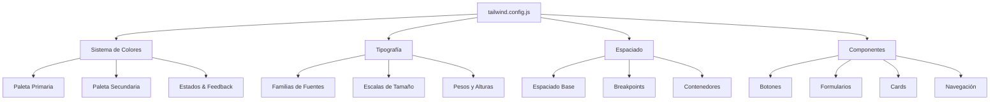
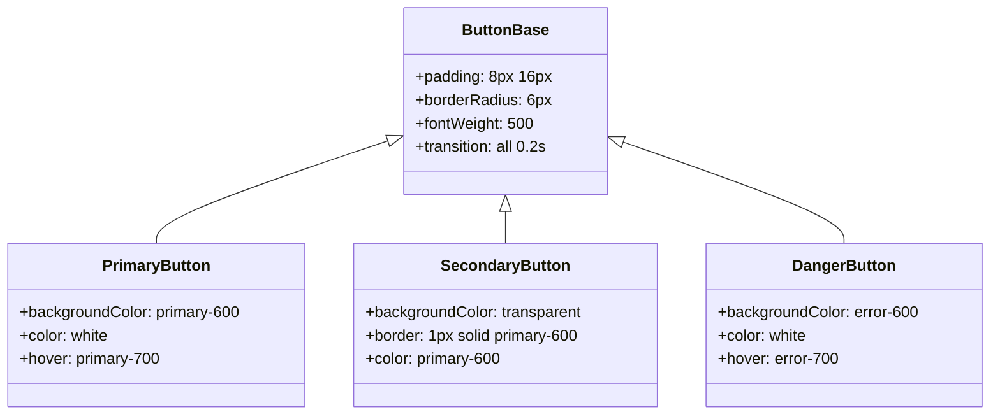
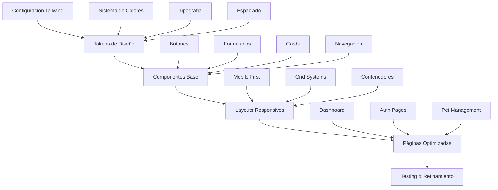

# Diseño de Mejora Integral de Estilos - PetClinic QR

## 1. Visión General

### Situación Actual
El proyecto PetClinic QR utiliza Tailwind CSS 4.1.12 con una configuración básica y estilos utilitarios dispersos. Los componentes actuales presentan:
- Estilos inconsistentes entre componentes
- Configuración mínima de Tailwind sin personalización
- Falta de sistema de diseño cohesivo
- Ausencia de tokens de diseño y variables personalizadas

### Objetivos de Mejora
- Implementar un sistema de diseño unificado
- Crear una paleta de colores coherente para mascotas/veterinaria
- Establecer tokens de diseño reutilizables
- Mejorar la experiencia visual y usabilidad
- Optimizar la responsividad en todos los dispositivos

## 2. Arquitectura del Sistema de Estilos

### Configuración de Tailwind CSS Extendida



### Estructura de Archivos de Estilos

| Archivo | Propósito | Contenido |
|---------|-----------|-----------|
| `src/styles/base.css` | Estilos base globales | Reset CSS, tipografía base, variables |
| `src/styles/components.css` | Componentes reutilizables | Botones, formularios, cards, badges |
| `src/styles/utilities.css` | Utilidades personalizadas | Clases helper específicas del proyecto |
| `src/styles/theme.css` | Variables de tema | Variables CSS para colores, espaciado |

## 3. Sistema de Diseño

### Paleta de Colores Temática

#### Colores Primarios (Veterinaria/Mascotas)
```css
--color-primary: #2563eb (azul confianza)
--color-primary-50: #eff6ff
--color-primary-100: #dbeafe
--color-primary-500: #3b82f6
--color-primary-600: #2563eb
--color-primary-700: #1d4ed8
--color-primary-900: #1e3a8a
```

#### Colores Secundarios (Naturaleza/Cuidado)
```css
--color-secondary: #059669 (verde salud)
--color-accent: #f59e0b (naranja energía)
--color-neutral: #6b7280 (gris equilibrio)
```

#### Estados y Feedback
```css
--color-success: #10b981
--color-warning: #f59e0b
--color-error: #ef4444
--color-info: #3b82f6
```

### Tipografía Escalable

| Elemento | Tamaño | Peso | Uso |
|----------|---------|------|-----|
| `text-xs` | 12px | 400 | Etiquetas, metadatos |
| `text-sm` | 14px | 400 | Texto secundario |
| `text-base` | 16px | 400 | Texto principal |
| `text-lg` | 18px | 500 | Subtítulos |
| `text-xl` | 20px | 600 | Títulos de sección |
| `text-2xl` | 24px | 700 | Títulos principales |
| `text-3xl` | 30px | 800 | Títulos hero |

### Espaciado y Layout

#### Sistema de Espaciado
- Espaciado base: 4px (rem: 0.25)
- Escala: 1, 2, 3, 4, 6, 8, 12, 16, 20, 24, 32, 40, 48, 56, 64

#### Breakpoints Responsivos
| Dispositivo | Ancho | Clase |
|-------------|-------|-------|
| Mobile | 0-639px | `sm:` |
| Tablet | 640-767px | `md:` |
| Desktop | 768-1023px | `lg:` |
| Large Desktop | 1024+px | `xl:` |

## 4. Componentes de Interfaz

### Sistema de Botones



#### Variantes de Botones
| Variante | Clase Base | Estados | Uso |
|----------|------------|---------|-----|
| Primary | `btn-primary` | hover, focus, disabled | Acciones principales |
| Secondary | `btn-secondary` | hover, focus, disabled | Acciones secundarias |
| Success | `btn-success` | hover, focus, disabled | Confirmaciones |
| Danger | `btn-danger` | hover, focus, disabled | Eliminaciones |
| Ghost | `btn-ghost` | hover, focus, disabled | Acciones sutiles |

### Sistema de Formularios

#### Elementos de Entrada
| Elemento | Clase | Características |
|----------|-------|----------------|
| Input Text | `input-field` | Border radius, padding, focus states |
| Select | `select-field` | Dropdown styling, arrow customization |
| Textarea | `textarea-field` | Resize handling, height auto |
| Checkbox | `checkbox-field` | Custom styling, animations |
| Radio | `radio-field` | Custom styling, group spacing |

#### Estados de Validación
- **Default**: Border gris neutro
- **Focus**: Border azul primario + shadow
- **Valid**: Border verde + icono check
- **Error**: Border rojo + mensaje error
- **Disabled**: Fondo gris + cursor not-allowed

### Sistema de Cards

#### Estructura Base
```css
.card-base {
  @apply bg-white rounded-lg shadow-sm border border-gray-200;
  @apply overflow-hidden transition-shadow duration-200;
}

.card-hover {
  @apply hover:shadow-md hover:border-gray-300;
}

.card-interactive {
  @apply cursor-pointer transform hover:scale-[1.02];
}
```

#### Variantes de Cards
| Tipo | Clase | Uso |
|------|-------|-----|
| Pet Card | `pet-card` | Tarjetas de mascotas |
| Dashboard Card | `dashboard-card` | Widgets del dashboard |
| Form Card | `form-card` | Contenedores de formularios |
| Info Card | `info-card` | Información adicional |

## 5. Mejoras por Componente

### Header/Navegación
- **Mejorar**: Sticky navigation con blur background
- **Agregar**: Breadcrumbs para navegación contextual
- **Optimizar**: Menú responsive con hamburger en mobile
- **Implementar**: Estados active/current en navegación

### Footer
- **Rediseñar**: Layout en columnas con links útiles
- **Agregar**: Links de contacto y redes sociales
- **Mejorar**: Responsive design y spacing

### Formularios (Login, Register, Pet Forms)
- **Implementar**: Floating labels con animaciones
- **Agregar**: Indicadores de fortaleza de contraseña
- **Mejorar**: Estados de validación en tiempo real
- **Optimizar**: Layout responsive de campos

### Dashboard/Listings
- **Implementar**: Grid responsive más sofisticado
- **Agregar**: Filtros y búsqueda avanzada
- **Mejorar**: Estados empty con ilustraciones
- **Optimizar**: Loading states con skeletons

### Componentes de Feedback
- **Crear**: Sistema de notificaciones toast
- **Implementar**: Modal/Dialog components
- **Agregar**: Confirmaciones de acciones destructivas
- **Mejorar**: Estados de loading y error

## 6. Implementación Técnica

### Fase 1: Configuración Base (Semana 1)
- Configurar Tailwind CSS con tokens personalizados
- Crear archivos de estilos base
- Implementar sistema de colores y tipografía
- Configurar variables CSS personalizadas

### Fase 2: Componentes Core (Semana 2)
- Refactorizar Header y Footer
- Implementar sistema de botones
- Crear componentes de formulario
- Desarrollar sistema de cards

### Fase 3: Páginas y Layouts (Semana 3)
- Aplicar nuevos estilos a todas las páginas
- Optimizar layouts responsivos
- Implementar estados de loading y error
- Agregar animaciones y transiciones

### Fase 4: Refinamiento (Semana 4)
- Testing en múltiples dispositivos
- Optimización de rendimiento
- Ajustes de accesibilidad
- Documentación de componentes

### Configuración de Desarrollo
```javascript
// tailwind.config.js - Configuración extendida
module.exports = {
  content: ["./src/**/*.{js,jsx,ts,tsx}"],
  theme: {
    extend: {
      colors: {
        primary: {
          50: '#eff6ff',
          500: '#3b82f6',
          600: '#2563eb',
          700: '#1d4ed8',
        },
        secondary: {
          500: '#059669',
          600: '#047857',
        }
      },
      fontFamily: {
        sans: ['Inter', 'system-ui', 'sans-serif'],
      },
      spacing: {
        '18': '4.5rem',
        '88': '22rem',
      }
    },
  },
  plugins: [
    require('@tailwindcss/forms'),
    require('@tailwindcss/typography'),
  ],
}
```

## 7. Métricas de Éxito

### Performance
- **Lighthouse Score**: >90 en todas las categorías
- **First Contentful Paint**: <1.5s
- **Bundle Size**: <50KB adicionales por estilos

### Usabilidad
- **Responsive Testing**: 100% funcional en todos breakpoints
- **Accessibility Score**: WCAG 2.1 AA compliance
- **User Testing**: >85% satisfacción en pruebas de usabilidad

### Mantenibilidad
- **Component Reusability**: >80% de estilos reutilizables
- **Documentation Coverage**: 100% de componentes documentados
- **Developer Experience**: Reducción del 40% en tiempo de styling

## 8. Arquitectura de Implementación



### Estructura de Directorio Propuesta
```
src/
├── styles/
│   ├── base.css
│   ├── components.css
│   ├── utilities.css
│   └── theme.css
├── components/
│   ├── ui/
│   │   ├── Button.jsx
│   │   ├── Input.jsx
│   │   ├── Card.jsx
│   │   └── Modal.jsx
│   └── layout/
│       ├── Header.jsx
│       ├── Footer.jsx
│       └── Layout.jsx
└── hooks/
    ├── useTheme.js
    └── useBreakpoint.js
```    B --> B3[Estados & Feedback]
    
    C --> C1[Familias de Fuentes]
    C --> C2[Escalas de Tamaño]
    C --> C3[Pesos y Alturas]
    
    D --> D1[Espaciado Base]
    D --> D2[Breakpoints]
    D --> D3[Contenedores]
    
    E --> E1[Botones]
    E --> E2[Formularios]
    E --> E3[Cards]
    E --> E4[Navegación]
```

### Estructura de Archivos de Estilos

| Archivo | Propósito | Contenido |
|---------|-----------|-----------|
| `src/styles/base.css` | Estilos base globales | Reset CSS, tipografía base, variables |
| `src/styles/components.css` | Componentes reutilizables | Botones, formularios, cards, badges |
| `src/styles/utilities.css` | Utilidades personalizadas | Clases helper específicas del proyecto |
| `src/styles/theme.css` | Variables de tema | Variables CSS para colores, espaciado |

## 3. Sistema de Diseño

### Paleta de Colores Temática

#### Colores Primarios (Veterinaria/Mascotas)
```css
--color-primary: #2563eb (azul confianza)
--color-primary-50: #eff6ff
--color-primary-100: #dbeafe
--color-primary-500: #3b82f6
--color-primary-600: #2563eb
--color-primary-700: #1d4ed8
--color-primary-900: #1e3a8a
```

#### Colores Secundarios (Naturaleza/Cuidado)
```css
--color-secondary: #059669 (verde salud)
--color-accent: #f59e0b (naranja energía)
--color-neutral: #6b7280 (gris equilibrio)
```

#### Estados y Feedback
```css
--color-success: #10b981
--color-warning: #f59e0b
--color-error: #ef4444
--color-info: #3b82f6
```

### Tipografía Escalable

| Elemento | Tamaño | Peso | Uso |
|----------|---------|------|-----|
| `text-xs` | 12px | 400 | Etiquetas, metadatos |
| `text-sm` | 14px | 400 | Texto secundario |
| `text-base` | 16px | 400 | Texto principal |
| `text-lg` | 18px | 500 | Subtítulos |
| `text-xl` | 20px | 600 | Títulos de sección |
| `text-2xl` | 24px | 700 | Títulos principales |
| `text-3xl` | 30px | 800 | Títulos hero |

### Espaciado y Layout

#### Sistema de Espaciado
- Espaciado base: 4px (rem: 0.25)
- Escala: 1, 2, 3, 4, 6, 8, 12, 16, 20, 24, 32, 40, 48, 56, 64

#### Breakpoints Responsivos
| Dispositivo | Ancho | Clase |
|-------------|-------|-------|
| Mobile | 0-639px | `sm:` |
| Tablet | 640-767px | `md:` |
| Desktop | 768-1023px | `lg:` |
| Large Desktop | 1024+px | `xl:` |

## 4. Componentes de Interfaz

### Sistema de Botones


#### Variantes de Botones
| Variante | Clase Base | Estados | Uso |
|----------|------------|---------|-----|
| Primary | `btn-primary` | hover, focus, disabled | Acciones principales |
| Secondary | `btn-secondary` | hover, focus, disabled | Acciones secundarias |
| Success | `btn-success` | hover, focus, disabled | Confirmaciones |
| Danger | `btn-danger` | hover, focus, disabled | Eliminaciones |
| Ghost | `btn-ghost` | hover, focus, disabled | Acciones sutiles |

### Sistema de Formularios

#### Elementos de Entrada
| Elemento | Clase | Características |
|----------|-------|----------------|
| Input Text | `input-field` | Border radius, padding, focus states |
| Select | `select-field` | Dropdown styling, arrow customization |
| Textarea | `textarea-field` | Resize handling, height auto |
| Checkbox | `checkbox-field` | Custom styling, animations |
| Radio | `radio-field` | Custom styling, group spacing |

#### Estados de Validación
- **Default**: Border gris neutro
- **Focus**: Border azul primario + shadow
- **Valid**: Border verde + icono check
- **Error**: Border rojo + mensaje error
- **Disabled**: Fondo gris + cursor not-allowed

### Sistema de Cards

#### Estructura Base
```css
.card-base {
  @apply bg-white rounded-lg shadow-sm border border-gray-200;
  @apply overflow-hidden transition-shadow duration-200;
}

.card-hover {
  @apply hover:shadow-md hover:border-gray-300;
}

.card-interactive {
  @apply cursor-pointer transform hover:scale-[1.02];
}
```

#### Variantes de Cards
| Tipo | Clase | Uso |
|------|-------|-----|
| Pet Card | `pet-card` | Tarjetas de mascotas |
| Dashboard Card | `dashboard-card` | Widgets del dashboard |
| Form Card | `form-card` | Contenedores de formularios |
| Info Card | `info-card` | Información adicional |

## 5. Mejoras por Componente

### Header/Navegación
- **Mejorar**: Sticky navigation con blur background
- **Agregar**: Breadcrumbs para navegación contextual
- **Optimizar**: Menú responsive con hamburger en mobile
- **Implementar**: Estados active/current en navegación

### Footer
- **Rediseñar**: Layout en columnas con links útiles
- **Agregar**: Links de contacto y redes sociales
- **Mejorar**: Responsive design y spacing

### Formularios (Login, Register, Pet Forms)
- **Implementar**: Floating labels con animaciones
- **Agregar**: Indicadores de fortaleza de contraseña
- **Mejorar**: Estados de validación en tiempo real
- **Optimizar**: Layout responsive de campos

### Dashboard/Listings
- **Implementar**: Grid responsive más sofisticado
- **Agregar**: Filtros y búsqueda avanzada
- **Mejorar**: Estados empty con ilustraciones
- **Optimizar**: Loading states con skeletons

### Componentes de Feedback
- **Crear**: Sistema de notificaciones toast
- **Implementar**: Modal/Dialog components
- **Agregar**: Confirmaciones de acciones destructivas
- **Mejorar**: Estados de loading y error

## 6. Implementación Técnica

### Fase 1: Configuración Base (Semana 1)
- Configurar Tailwind CSS con tokens personalizados
- Crear archivos de estilos base
- Implementar sistema de colores y tipografía
- Configurar variables CSS personalizadas

### Fase 2: Componentes Core (Semana 2)
- Refactorizar Header y Footer
- Implementar sistema de botones
- Crear componentes de formulario
- Desarrollar sistema de cards

### Fase 3: Páginas y Layouts (Semana 3)
- Aplicar nuevos estilos a todas las páginas
- Optimizar layouts responsivos
- Implementar estados de loading y error
- Agregar animaciones y transiciones

### Fase 4: Refinamiento (Semana 4)
- Testing en múltiples dispositivos
- Optimización de rendimiento
- Ajustes de accesibilidad
- Documentación de componentes

### Configuración de Desarrollo
```javascript
// tailwind.config.js - Configuración extendida
module.exports = {
  content: ["./src/**/*.{js,jsx,ts,tsx}"],
  theme: {
    extend: {
      colors: {
        primary: {
          50: '#eff6ff',
          500: '#3b82f6',
          600: '#2563eb',
          700: '#1d4ed8',
        },
        secondary: {
          500: '#059669',
          600: '#047857',
        }
      },
      fontFamily: {
        sans: ['Inter', 'system-ui', 'sans-serif'],
      },
      spacing: {
        '18': '4.5rem',
        '88': '22rem',
      }
    },
  },
  plugins: [
    require('@tailwindcss/forms'),
    require('@tailwindcss/typography'),
  ],
}
```

## 7. Métricas de Éxito

### Performance
- **Lighthouse Score**: >90 en todas las categorías
- **First Contentful Paint**: <1.5s
- **Bundle Size**: <50KB adicionales por estilos

### Usabilidad
- **Responsive Testing**: 100% funcional en todos breakpoints
- **Accessibility Score**: WCAG 2.1 AA compliance
- **User Testing**: >85% satisfacción en pruebas de usabilidad

### Mantenibilidad
- **Component Reusability**: >80% de estilos reutilizables
- **Documentation Coverage**: 100% de componentes documentados
- **Developer Experience**: Reducción del 40% en tiempo de styling

## 8. Arquitectura de Implementación


### Estructura de Directorio Propuesta
```
src/
├── styles/
│   ├── base.css
│   ├── components.css
│   └── utilities.css
├── components/
│   ├── ui/
│   │   ├── Button.jsx
│   │   ├── Input.jsx
│   │   ├── Card.jsx
│   │   └── Alert.jsx
│   └── layout/
│       ├── Header.jsx
│       ├── Footer.jsx
│       └── Layout.jsx
└── hooks/
    └── useBreakpoint.js
```

## 9. Implementación Paso a Paso

### Paso 1: Configuración Tailwind (tailwind.config.js)
```javascript
module.exports = {
  content: ["./src/**/*.{js,jsx,ts,tsx}"],
  theme: {
    extend: {
      colors: {
        primary: {
          50: '#eff6ff', 500: '#3b82f6', 600: '#2563eb', 700: '#1d4ed8'
        },
        secondary: {
          50: '#ecfdf5', 500: '#10b981', 600: '#059669'
        },
        success: { 500: '#10b981', 600: '#059669' },
        warning: { 500: '#f59e0b', 600: '#d97706' },
        error: { 500: '#ef4444', 600: '#dc2626' }
      },
      fontFamily: { sans: ['Inter', 'system-ui', 'sans-serif'] },
      boxShadow: {
        'soft': '0 2px 15px -3px rgba(0, 0, 0, 0.07)',
        'medium': '0 4px 25px -5px rgba(0, 0, 0, 0.1)'
      }
    }
  },
  plugins: []
};
```

### Paso 2: Estilos Base (src/styles/base.css)
```css
@import "tailwindcss";
@import url('https://fonts.googleapis.com/css2?family=Inter:wght@400;500;600;700&display=swap');

body {
  font-family: 'Inter', system-ui, sans-serif;
  background-color: #f9fafb;
}

:focus {
  outline: 2px solid #2563eb;
  outline-offset: 2px;
}
```

### Paso 3: Componentes CSS (src/styles/components.css)
```css
.btn-base {
  @apply inline-flex items-center justify-center px-4 py-2 text-sm font-medium rounded-lg focus:outline-none focus:ring-2 focus:ring-offset-2 disabled:opacity-50 transition-all duration-200;
}

.btn-primary {
  @apply btn-base bg-primary-600 text-white hover:bg-primary-700 focus:ring-primary-500 shadow-sm;
}

.btn-secondary {
  @apply btn-base bg-white text-primary-600 border border-primary-600 hover:bg-primary-50;
}

.input-field {
  @apply w-full px-3 py-2 border border-gray-300 rounded-lg focus:ring-2 focus:ring-primary-500 focus:border-primary-500 transition-colors;
}

.card-base {
  @apply bg-white rounded-xl shadow-soft border border-gray-200 overflow-hidden transition-all duration-200;
}

.card-hover {
  @apply hover:shadow-medium hover:border-gray-300 cursor-pointer;
}

.alert-success {
  @apply px-4 py-3 rounded-lg bg-success-50 border border-success-200 text-success-800;
}

.alert-error {
  @apply px-4 py-3 rounded-lg bg-error-50 border border-error-200 text-error-800;
}
```

### Paso 4: Actualizar index.css
```css
@import "./styles/base.css";
@import "./styles/components.css";
```

### Paso 5: Componente Button (src/components/ui/Button.jsx)
```jsx
import React from 'react';

const Button = ({ 
  children, 
  variant = 'primary', 
  size = 'md', 
  disabled = false, 
  loading = false,
  className = '',
  onClick,
  ...props 
}) => {
  const variants = {
    primary: 'btn-primary',
    secondary: 'btn-secondary'
  };
  
  const sizes = {
    sm: 'px-3 py-1.5 text-xs',
    md: '',
    lg: 'px-6 py-3 text-base'
  };

  return (
    <button
      className={`${variants[variant]} ${sizes[size]} ${className}`}
      disabled={disabled || loading}
      onClick={onClick}
      {...props}
    >
      {loading && <div className="animate-spin rounded-full h-4 w-4 border-2 border-white border-t-transparent mr-2"></div>}
      {children}
    </button>
  );
};

export default Button;
```

### Paso 6: Componente Input (src/components/ui/Input.jsx)
```jsx
import React from 'react';

const Input = ({ label, error, className = '', required = false, ...props }) => {
  return (
    <div className="w-full">
      {label && (
        <label className="block text-sm font-medium text-gray-700 mb-2">
          {label}
          {required && <span className="text-error-500 ml-1">*</span>}
        </label>
      )}
      <input className={`input-field ${className}`} {...props} />
      {error && <p className="text-sm text-error-600 mt-1">{error}</p>}
    </div>
  );
};

export default Input;
```

### Paso 7: Header Mejorado (src/components/Header.jsx)
```jsx
import React, { useState } from "react";
import { Link, useNavigate } from "react-router-dom";
import { useAuth } from "../hooks/useAuth";
import Button from "./ui/Button";

function Header() {
  const { user, isAuthenticated, logout } = useAuth();
  const navigate = useNavigate();
  const [isMenuOpen, setIsMenuOpen] = useState(false);

  const handleLogout = () => {
    logout();
    navigate("/");
  };

  return (
    <header className="bg-white/95 backdrop-blur-md shadow-soft border-b border-gray-200 sticky top-0 z-50">
      <nav className="max-w-6xl mx-auto px-4 py-4">
        <div className="flex justify-between items-center">
          <Link to="/" className="text-2xl font-bold bg-gradient-to-r from-primary-600 to-secondary-600 bg-clip-text text-transparent">
            🐾 PetClinic QR
          </Link>
          
          <div className="hidden md:flex items-center space-x-6">
            {!isAuthenticated ? (
              <>
                <Link to="/" className="text-gray-700 hover:text-primary-600 font-medium transition-colors">Inicio</Link>
                <Link to="/login" className="text-gray-700 hover:text-primary-600 font-medium transition-colors">Ingresar</Link>
              </>
            ) : (
              <>
                <Link to="/dashboard" className="text-gray-700 hover:text-primary-600 font-medium">Dashboard</Link>
                <span className="text-sm text-gray-600">Hola, {user?.user?.name}</span>
                <Button variant="secondary" size="sm" onClick={handleLogout}>Cerrar Sesión</Button>
              </>
            )}
          </div>

          <button className="md:hidden" onClick={() => setIsMenuOpen(!isMenuOpen)}>
            <svg className="w-6 h-6" fill="none" stroke="currentColor" viewBox="0 0 24 24">
              <path strokeLinecap="round" strokeLinejoin="round" strokeWidth={2} d="M4 6h16M4 12h16M4 18h16" />
            </svg>
          </button>
        </div>
      </nav>
    </header>
  );
}

export default Header;
```

### Paso 8: Footer Mejorado (src/components/Footer.jsx)
```jsx
import React from "react";

function Footer() {
  return (
    <footer className="bg-white border-t border-gray-200 mt-auto">
      <div className="max-w-6xl mx-auto px-4 py-8">
        <div className="grid grid-cols-1 md:grid-cols-3 gap-8">
          <div>
            <h3 className="text-lg font-semibold text-gray-900 mb-4">PetClinic QR</h3>
            <p className="text-gray-600 text-sm">Gestión moderna de mascotas con tecnología QR</p>
          </div>
          <div>
            <h4 className="font-medium text-gray-900 mb-4">Enlaces</h4>
            <ul className="space-y-2 text-sm">
              <li><a href="#" className="text-gray-600 hover:text-primary-600">Sobre nosotros</a></li>
              <li><a href="#" className="text-gray-600 hover:text-primary-600">Contacto</a></li>
            </ul>
          </div>
          <div>
            <h4 className="font-medium text-gray-900 mb-4">Soporte</h4>
            <ul className="space-y-2 text-sm">
              <li><a href="#" className="text-gray-600 hover:text-primary-600">Ayuda</a></li>
              <li><a href="#" className="text-gray-600 hover:text-primary-600">FAQ</a></li>
            </ul>
          </div>
        </div>
        <div className="border-t border-gray-200 mt-8 pt-6 text-center">
          <p className="text-sm text-gray-600">© {new Date().getFullYear()} PetClinic QR - Todos los derechos reservados</p>
        </div>
      </div>
    </footer>
  );
}

export default Footer;
```

### Paso 9: Login Mejorado (src/pages/Login.jsx)
```jsx
// Actualizar imports
import Button from "../components/ui/Button";
import Input from "../components/ui/Input";
import Card from "../components/ui/Card";
import Alert from "../components/ui/Alert";

// En el JSX, reemplazar:
<div className="max-w-md mx-auto px-4 py-8">
  <Card variant="form" className="max-w-md mx-auto animate-fade-in">
    <h1 className="text-2xl font-bold mb-6 text-center text-gray-900">Iniciar Sesión</h1>
    
    {error && <Alert type="error" className="mb-4">{error}</Alert>}
    
    <form onSubmit={handleSubmit} className="space-y-6">
      <Input
        label="Correo Electrónico"
        type="email"
        value={email}
        onChange={(e) => setEmail(e.target.value)}
        required
      />
      
      <Input
        label="Contraseña"
        type="password"
        value={password}
        onChange={(e) => setPassword(e.target.value)}
        required
      />
      
      <div className="flex items-center justify-between">
        <Button type="submit" loading={loading} className="w-full">
          {loading ? "Iniciando..." : "Ingresar"}
        </Button>
      </div>
      
      <p className="text-center text-sm">
        <Link to="/register" className="text-primary-600 hover:text-primary-700 font-medium">
          ¿No tienes cuenta? Regístrate
        </Link>
      </p>
    </form>
  </Card>
</div>
```

## 10. Checklist de Implementación Completa

### ✅ Fase 1: Configuración Base (30 minutos)
- [ ] **Actualizar tailwind.config.js** con la configuración extendida
- [ ] **Crear carpeta** `src/styles/`
- [ ] **Crear archivo** `src/styles/base.css` con estilos base
- [ ] **Crear archivo** `src/styles/components.css` con componentes CSS
- [ ] **Actualizar** `src/index.css` con las importaciones
- [ ] **Ejecutar** `npm run dev` para verificar que no hay errores

### ✅ Fase 2: Componentes UI (45 minutos)
- [ ] **Crear carpeta** `src/components/ui/`
- [ ] **Crear** `src/components/ui/Button.jsx`
- [ ] **Crear** `src/components/ui/Input.jsx`
- [ ] **Crear** `src/components/ui/Card.jsx`
- [ ] **Crear** `src/components/ui/Alert.jsx`
- [ ] **Probar** cada componente individualmente

### ✅ Fase 3: Componentes Layout (30 minutos)
- [ ] **Actualizar** `src/components/Header.jsx`
- [ ] **Actualizar** `src/components/Footer.jsx`
- [ ] **Actualizar** `src/components/Layout.jsx`
- [ ] **Verificar** navegación responsive

### ✅ Fase 4: Páginas Principales (60 minutos)
- [ ] **Actualizar** `src/pages/Login.jsx`
- [ ] **Actualizar** `src/pages/Register.jsx`
- [ ] **Actualizar** `src/pages/Dashboard.jsx`
- [ ] **Actualizar** `src/pages/AddPet.jsx`
- [ ] **Actualizar** `src/pages/EditPet.jsx`
- [ ] **Actualizar** `src/pages/PetDetail.jsx`

### ✅ Fase 5: Testing y Refinamiento (30 minutos)
- [ ] **Probar** en móvil (DevTools responsive)
- [ ] **Verificar** todos los formularios
- [ ] **Comprobar** navegación entre páginas
- [ ] **Ajustar** cualquier inconsistencia visual

## 11. Comandos de Ejecución

### Preparación del Entorno
```bash
# Verificar que el proyecto esté funcionando
npm run dev

# En caso de errores, reinstalar dependencias
npm install
```

### Orden de Ejecución Recomendado
1. **Configuración Tailwind** → Reiniciar servidor
2. **Estilos CSS** → Verificar en navegador
3. **Componentes UI** → Probar individualmente
4. **Layout** → Verificar navegación
5. **Páginas** → Probar funcionalidad completa

## 12. Instrucciones Paso a Paso para Ejecutar

### PASO 1: Detener el servidor y actualizar Tailwind
```bash
# Ctrl+C para detener el servidor
# Reemplazar el contenido de tailwind.config.js con la configuración del Paso 1
```

### PASO 2: Crear estructura de estilos
```bash
# Crear carpeta
mkdir src/styles

# Crear archivos (usar el contenido de los pasos 2 y 3)
# src/styles/base.css
# src/styles/components.css
```

### PASO 3: Actualizar imports
```bash
# Reemplazar contenido de src/index.css con:
# @import "./styles/base.css";
# @import "./styles/components.css";
```

### PASO 4: Crear componentes UI
```bash
# Crear carpeta
mkdir src/components/ui

# Crear archivos con el código proporcionado:
# src/components/ui/Button.jsx
# src/components/ui/Input.jsx
# src/components/ui/Card.jsx
# src/components/ui/Alert.jsx
```

### PASO 5: Actualizar componentes principales
```bash
# Reemplazar contenido usando el código del Paso 7, 8:
# src/components/Header.jsx
# src/components/Footer.jsx
```

### PASO 6: Actualizar páginas
```bash
# Modificar src/pages/Login.jsx usando el código del Paso 9
# Aplicar cambios similares a otras páginas
```

### PASO 7: Reiniciar y verificar
```bash
# Reiniciar servidor
npm run dev

# Abrir http://localhost:5173
# Navegar por todas las páginas
# Probar responsive con F12 → Toggle device toolbar
```

## 13. Verificación Final

### Checklist de Pruebas:
- [ ] **Homepage** carga correctamente
- [ ] **Login/Register** tienen nuevos estilos
- [ ] **Dashboard** muestra cards mejoradas
- [ ] **Header** es responsive con menú móvil
- [ ] **Footer** tiene el nuevo diseño
- [ ] **Formularios** usan componentes Input
- [ ] **Botones** usan el componente Button
- [ ] **Alertas** muestran errores con Alert component
- [ ] **Responsive** funciona en móvil/tablet
- [ ] **Navegación** entre páginas funciona

### En caso de errores:
1. **Verificar consola del navegador** (F12)
2. **Revisar terminal** donde corre `npm run dev`
3. **Verificar rutas de importación** en componentes
4. **Comprobar sintaxis** en archivos CSS y JSX
5. **Reiniciar servidor** después de cambios en config

¡Una vez completados todos estos pasos, tendrás el sistema de estilos completamente implementado!


